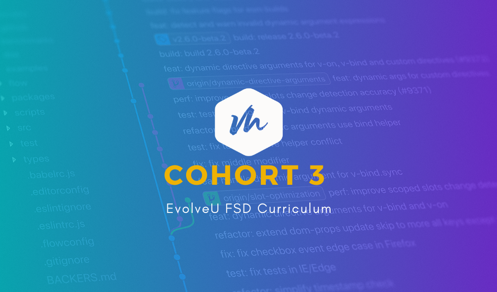

<p align="center">
  <a href="" rel="noopener">
 </a>
</p>

<div align="center">

---


</div>

---

<p align="center"> 🤖 This project is the "Getting Started" project for EvovleU Full Stack Development program. It is a baseline to demonstrate:
development environment
development tools
best practices
<br>

</p>

<!--
## 🎥 Demo / Working <a name = "demo"></a>

## 💭 How it works <a name = "working"></a> -->

## 🎈 Required Tools <a name = "usage"></a>

- The following tools are required to run the sample project:

  - git - If you do not have git installed, install with default parameters. See git. To check, enter:

```
git --version
```

- git - If you do not have git installed, install with default parameters. See git. To check, enter:

```
node -v
```

- VSCode - If you do not have VSCode installed see VSCode.
- live-server - is a little development server with live reload capability.

```
npm install -g live-server
```

## 🏁 Setup Instructions <a name = "setup_insttructions"></a>

For the following instructions use your command line. In Windows, it could be dos or PowerShell. For mac and Linux use terminal.

1. Clone this repository. In your command line move to the directory that you would like to use as your base code directory. This command will add a directory below the directory you are in.

```
git clone https://github.com/larryevolveu/reference.git
```

2. Install the dependencies required for the project. This command looks at the 'package.json' file and installs all of the dependencies.

```
cd reference
npm i
```

3. Install the dependencies required for the project. This command looks at the 'package.json' file and installs all of the dependencies.

```
cd src
cd 01-getting-started
npm test
```

All the tests should run.

## 🚀 Deploying the projects <a name = "Project"></a>

4. Start a simple development server with live load capabilities.

```
live-server
```

Look through the application. Notice in the "Size" section of the web page there is some logic that, based on a number, will tell you if it is small / medium / large.

## ⛏️ Dissecting what's there <a name = "dissecting"></a>

Let's start looking at this simple application. First, you will notice that the HTML and CSS in the project are fairly complicated. Like it or not, the design and layout is the sizzle that sells. The functionality is expected to work.

As Full Stack Developers, we will often be expected to contribute or even write the design component of the project. For the next six months, we will be concentrating on the Programming or logic component more than the css or html components. This does not mean that it's not important.

1. Notice the directory structure. It may not be exact, but it will be close.

```
reference
├── node_modules
│
├── src
│   └── 01-getting-started
│       ├── images
│       ├── scripts
│       ├── index.css
│       ├── index.html
│   └──  package.json
│   └──  README.md
```


## 🎉 Acknowledgements <a name = "acknowledgement"></a>

- LARRY SHUMLICH
